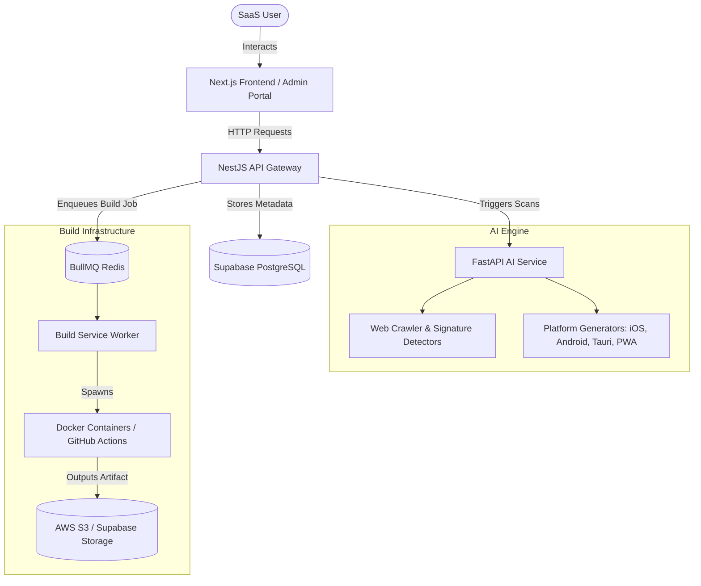

# Universal Web to Native Platform

## Overview
The **Universal Web to Native** platform is a production-grade full‑stack monorepo that transforms any web application into native mobile (iOS, Android), desktop (Windows, macOS, Linux), and progressive web app (PWA) clients. It provides a SaaS‑style workflow where users submit a website URL, the system analyzes the site structure using AI, generates platform‑specific wrapper code bases, builds native binaries asynchronously, and stores the resulting executable artifacts.

## Core Functionalities
- **Web‑site analysis** – FastAPI AI service crawls the target URL, detects UI components, routes, and assets.
- **Multi‑platform code generation** – Generators produce iOS (Swift), Android (Kotlin), desktop (Tauri/Electron), and PWA code bases.
- **Asynchronous build pipelines** – BullMQ + Redis workers enqueue build jobs, spin up Docker containers or GitHub Actions runners, and publish binaries to S3/Supabase storage.
- **User management & billing** – Supabase authentication, Stripe subscription handling, role‑based access control.
- **API gateway** – NestJS service exposing a unified REST/GraphQL API, handling authentication, rate‑limiting, and database interactions via Prisma.
- **Deployment & CI/CD** – Docker Compose for local development, Vercel for the Next.js front‑end, and GitHub Actions for production builds.

## Technologies Stack
| Layer | Technology |
|---|---|
| Front‑end | Next.js (React), Tailwind CSS, TypeScript, TanStack Query |
| API Gateway | NestJS, TypeScript, Prisma, PostgreSQL (Supabase) |
| AI Service | FastAPI (Python), OpenAI / Gemini / Claude APIs |
| Build Workers | Node.js, BullMQ, Redis |
| Containerisation | Docker, Docker Compose |
| Cloud Storage | AWS S3 / Supabase Storage |
| Billing | Stripe |
| CI/CD | GitHub Actions, Vercel |
| Database | PostgreSQL (hosted on Supabase) |
| Auth | Supabase Auth, JWT |

## Frontend Portal Pages & Routes

The Next.js web application is located under `apps/web` and includes the following fully routed and functional pages:

### Public Website & Authentication
* **Landing Page (`/`)** — `/app/page.tsx`
* **Features (`/features`)** — `/app/features/page.tsx`
* **Pricing (`/pricing`)** — `/app/pricing/page.tsx`
* **Documentation (`/docs`)** — `/app/docs/page.tsx`
* **Contact (`/contact`)** — `/app/contact/page.tsx`
* **Auth Pages** — Login, Register, Forgot Password, Reset Password, Verify Email located in `/app/(auth)/...`

### Core Dashboard
* **Main Dashboard (`/dashboard`)** — `/app/dashboard/page.tsx`
* **Projects Manager (`/dashboard/projects`)** — `/app/dashboard/projects/page.tsx`
* **Create Project (`/dashboard/projects/new`)** — `/app/dashboard/projects/new/page.tsx`
* **Website Import Wizard (`/dashboard/import`)** — `/app/dashboard/import/page.tsx`
* **Downloads Center (`/dashboard/downloads`)** — `/app/dashboard/downloads/page.tsx`
* **Notifications (`/dashboard/notifications`)** — `/app/dashboard/notifications/page.tsx`
* **API Keys Management (`/dashboard/api-keys`)** — `/app/dashboard/api-keys/page.tsx`

### AI Engine Suite
* **AI Dashboard (`/dashboard/ai`)** — `/app/dashboard/ai/page.tsx`
* **Website Scanner (`/dashboard/ai/scanner`)** — `/app/dashboard/ai/scanner/page.tsx`
* **Framework Detection (`/dashboard/ai/framework`)** — `/app/dashboard/ai/framework/page.tsx`
* **UI Analysis (`/dashboard/ai/ui-analysis`)** — `/app/dashboard/ai/ui-analysis/page.tsx`
* **API Detection (`/dashboard/ai/api-detection`)** — `/app/dashboard/ai/api-detection/page.tsx`
* **Security Scan (`/dashboard/ai/security`)** — `/app/dashboard/ai/security/page.tsx`
* **SEO Analysis (`/dashboard/ai/seo`)** — `/app/dashboard/ai/seo/page.tsx`
* **Performance Analysis (`/dashboard/ai/performance`)** — `/app/dashboard/ai/performance/page.tsx`
* **Accessibility Analysis (`/dashboard/ai/accessibility`)** — `/app/dashboard/ai/accessibility/page.tsx`
* **AI Recommendations (`/dashboard/ai/recommendations`)** — `/app/dashboard/ai/recommendations/page.tsx`

### App Generators
* **Android Settings, Preview & Build** — `/app/dashboard/generators/android/...` (page, preview, build, history)
* **iOS Settings, Preview & Build** — `/app/dashboard/generators/ios/...` (page, preview, build, history)
* **Desktop Settings, Preview & Build** — `/app/dashboard/generators/desktop/...` (page, preview, build, history)

### Build Infrastructure
* **Build System Overview (`/dashboard/build-system`)** — `/app/dashboard/build-system/page.tsx`
* **Build Queue (`/dashboard/build-system/queue`)** — `/app/dashboard/build-system/queue/page.tsx`
* **System Logs (`/dashboard/build-system/logs`)** — `/app/dashboard/build-system/logs/page.tsx`
* **Artifacts Storage (`/dashboard/build-system/artifacts`)** — `/app/dashboard/build-system/artifacts/page.tsx`

### Billing & Team Management
* **Subscription Management (`/dashboard/billing/subscription`)** — `/app/dashboard/billing/subscription/page.tsx`
* **Invoices (`/dashboard/billing/invoices`)** — `/app/dashboard/billing/invoices/page.tsx`
* **Payment Methods (`/dashboard/billing/payment-methods`)** — `/app/dashboard/billing/payment-methods/page.tsx`
* **Usage & Limits (`/dashboard/billing/usage`)** — `/app/dashboard/billing/usage/page.tsx`
* **Team Members (`/dashboard/team`)** — `/app/dashboard/team/page.tsx`
* **Roles & Permissions (`/dashboard/team/roles`)** — `/app/dashboard/team/roles/page.tsx`
* **Audit Logs (`/dashboard/team/audit`)** — `/app/dashboard/team/audit/page.tsx`

## Architecture Diagram


## Getting Started
```bash
# Clone the repository
git clone https://github.com/Arslan-web-Dev/web-to-app-and-destop.git
cd web-to-app-and-destop

# Install root dependencies
npm install

# Start required services (PostgreSQL, Redis) – see docker-compose.yml or use Docker Desktop
docker compose up -d postgres redis

# Generate Prisma client and push schema
npm run db:generate
npm run db:push

# Run the monorepo in development mode
npm run dev
```

## 🤝 Contributing

Contributions are welcome! Please follow these steps:

1. **Fork** the repository.
2. Create a feature branch: `git checkout -b feature/your-feature`
3. Make your changes and ensure they pass linting: `npm run lint`
4. Open a **Pull Request** with a clear description of the change.
5. Ensure the CI workflow passes before merging.

Read the full guidelines in [CONTRIBUTING.md](./CONTRIBUTING.md).

---

## 📄 License

This project is licensed under the **MIT License** – see the [LICENSE](./LICENSE) file for details.

---

## 📞 Contact

Feel free to reach out via:

- 📧 **Email:** [muhammadarslan.cs.web@gmail.com](mailto:muhammadarslan.cs.web@gmail.com)
- 💼 **LinkedIn:** [linkedin.com/in/muhammadarslan](https://linkedin.com/in/muhammadarslan)
- 🐦 **Twitter:** [twitter.com/muhammadarslan](https://twitter.com/muhammadarslan)

---

*Enhanced & Maintained by [Muhammad Arslan](https://linkedin.com/in/muhammadarslan)*
