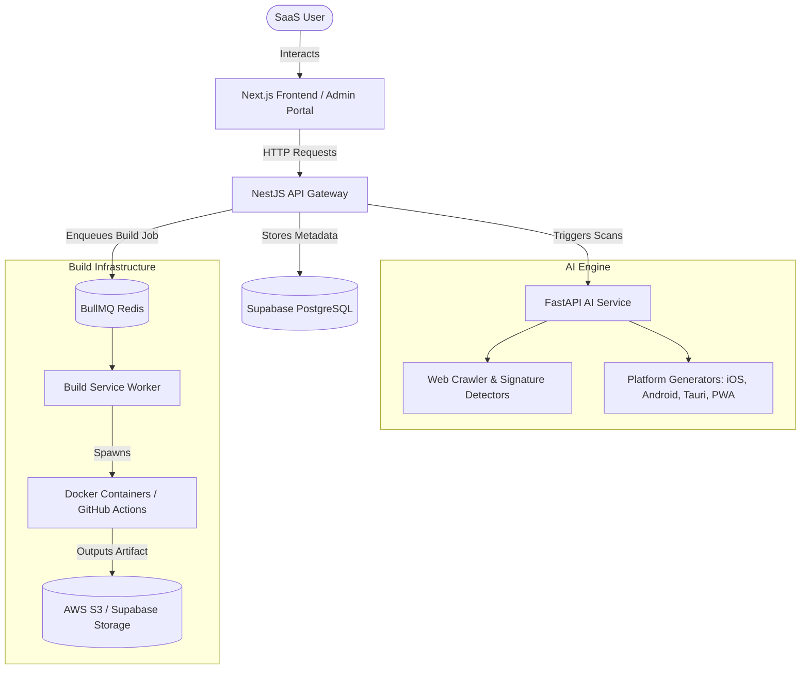

# Platform Architecture Guide

This document describes the architectural layout and processing workflow of the Universal Web to Native Platform.

## System Overview

## Microservices Breakdown

1. **API Gateway (NestJS)**
   - Acts as the unified entry point.
   - Manages accounts, sessions, database transactions via Prisma, rate-limiting, and Stripe billing.

2. **AI Service (FastAPI)**
   - Orchestrates website structural exploration and component parsing.
   - Outputs complete native client code bases using specialized platform generators.

3. **Build Workers (Node.js/BullMQ)**
   - Processes asynchronous native build pipelines.
   - Compiles projects via Docker containers (Android/Tauri/PWA) or cloud runners (iOS via Xcode/GitHub Actions).
